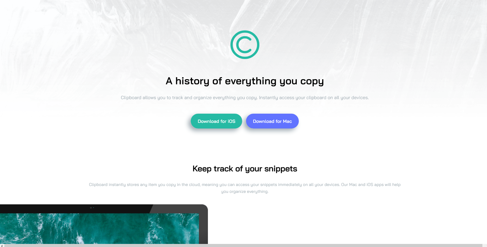

### This is a solution to the [Frontend Mentor](https://www.frontendmentor.io/home). challenge:

# Clipboard landing page

**Welcome! 👋 Here's a quick look:**

[Live Link](https://neenreva.github.io/clipboard-landing-page-master/) // [Solution Home](https://www.frontendmentor.io/challenges/clipboard-landing-page-5cc9bccd6c4c91111378ecb9/hub/clipboard-landing-page-BJOOLXoX5)

### The challenge

Your challenge is to build out this landing page and get it looking as close to the design as possible.

You can use any tools you like to help you complete the challenge. So if you've got something you'd like to practice, feel free to give it a go.

Your users should be able to: 

- View the optimal layout for the site depending on their device's screen size
- See hover states for all interactive elements on the page

### Built with

- Semantic HTML5 markup
- CSS custom properties
- Flexbox
- Mobile-first workflow

### Useful resources

- [PerfectPixel](https://chrome.google.com/webstore/detail/perfectpixel-by-welldonec/dkaagdgjmgdmbnecmcefdhjekcoceebi?hl=en) - Nailing down the diamentions as close as possible.

### As always feedback is welcome! Thanks for checking this out.